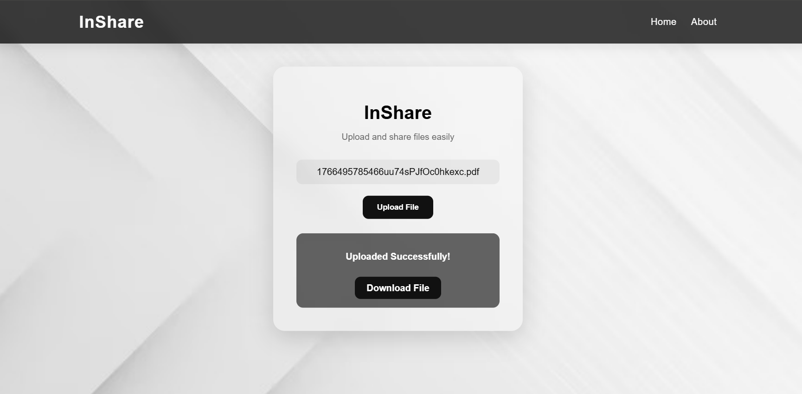
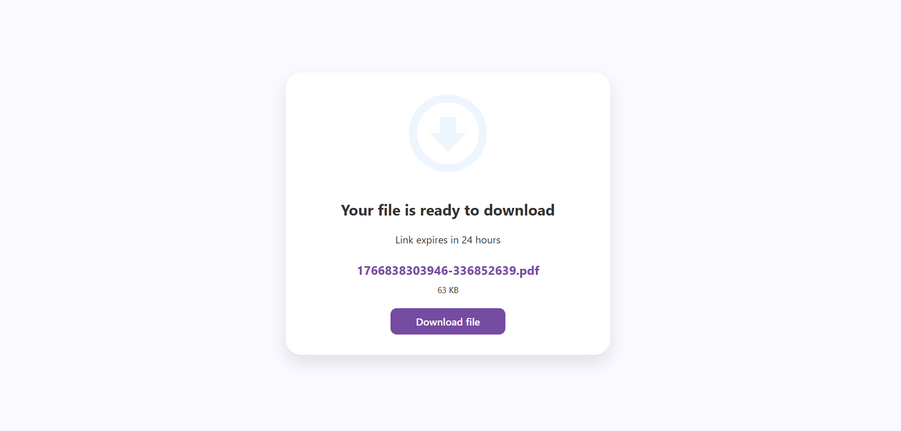

# 🚀 InShare - File Sharing App

A simple and elegant **file-sharing app** that allows users to upload and share files easily.  
Built using **React**, **Node.js**, **Express**, and **Multer**.

## 🌟 Features
- Upload and share files securely
- Copy and share file links instantly
- Modern and clean UI
- Responsive design

## 🛠️ Tech Stack
- **Frontend:** React
- **Backend:** Node.js, Express, Multer

## Home Page

## Upload Page

## Download Page

